# Project Overview
This application  provides a list of items within a variety of categories as well as provide a user registration and authentication system. Registered users will have the ability to post, edit and delete their own items.
This application has API endpoint with rate limit to provide list of categories and it's items.

# Project Detail

The Item Catalog project consists of developing an application that provides a list of items within a variety of categories, as well as provide a user registration and authentication system.

## Home page

### URL
Url for index page is `/`

### View for unauthenticated user

- The homepage displays all current categories along with the latest added items.
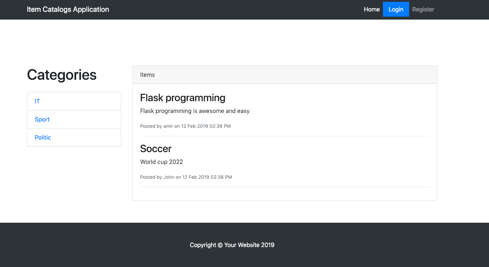

- By clicking on each category in index page we only see the items related to each category

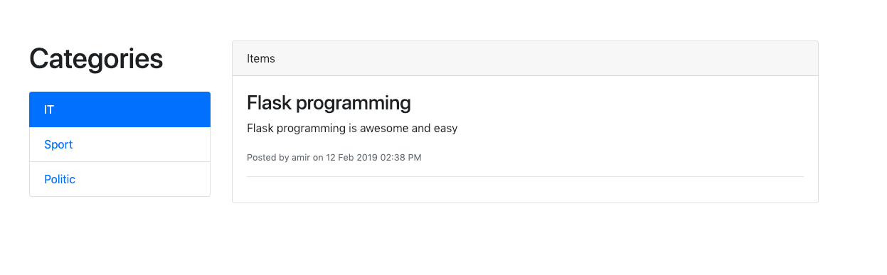

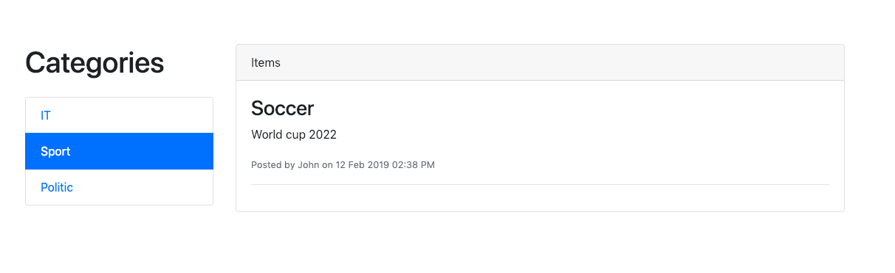

### Home page view for authenticated user

- after successful login user can create **New Category**, **New Item**, `Edit` and Delete his items
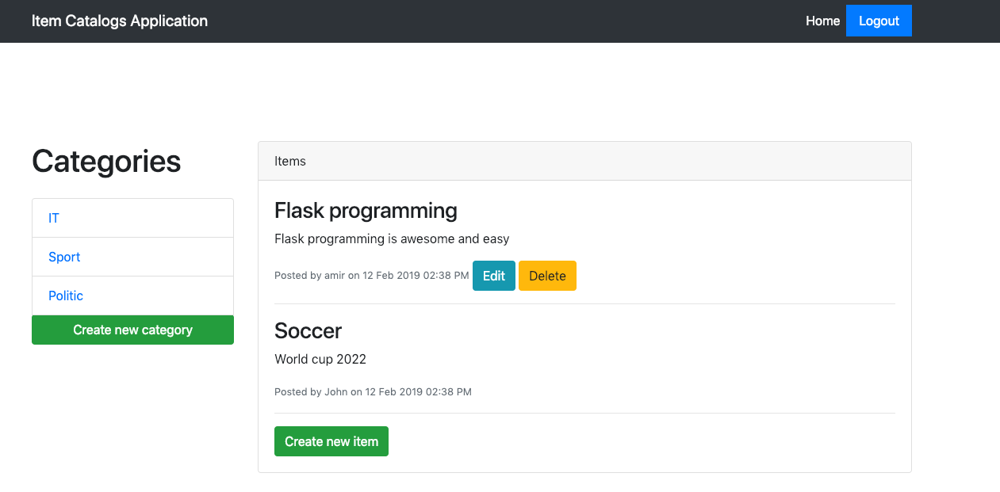

## Registration

### URL

URL for registration is `/register`

### View for registration

User should provide following information - all fields are required

- Username
- Email
- FirstName
- LastName
- Password

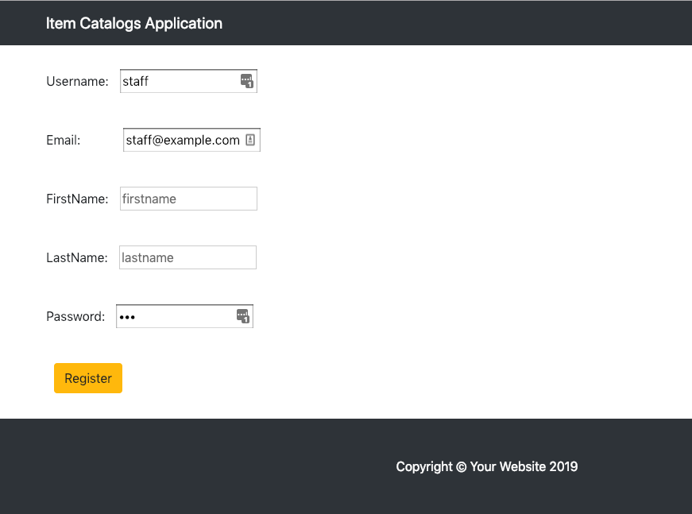

## Login

### URL

URL for registration is `/login`

### View for registration

User should provide following information - all fields are required

- Username
- Password

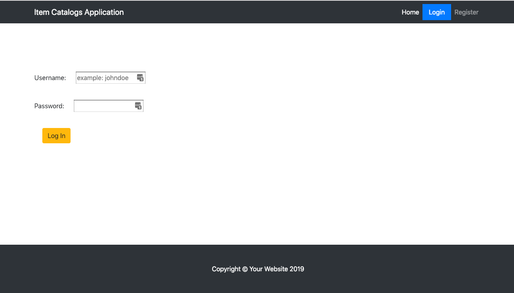

After user is logged in he gets redirected to `/` home page and can see **Create category**,
**Create item**, **Edit item** and **Delete Item** buttons (Editing and deleting only available for owned items)

After user is logged in `Login` button disappears and `Logout` button replaces it and when user click on `Logout` we drop all sessions for that user

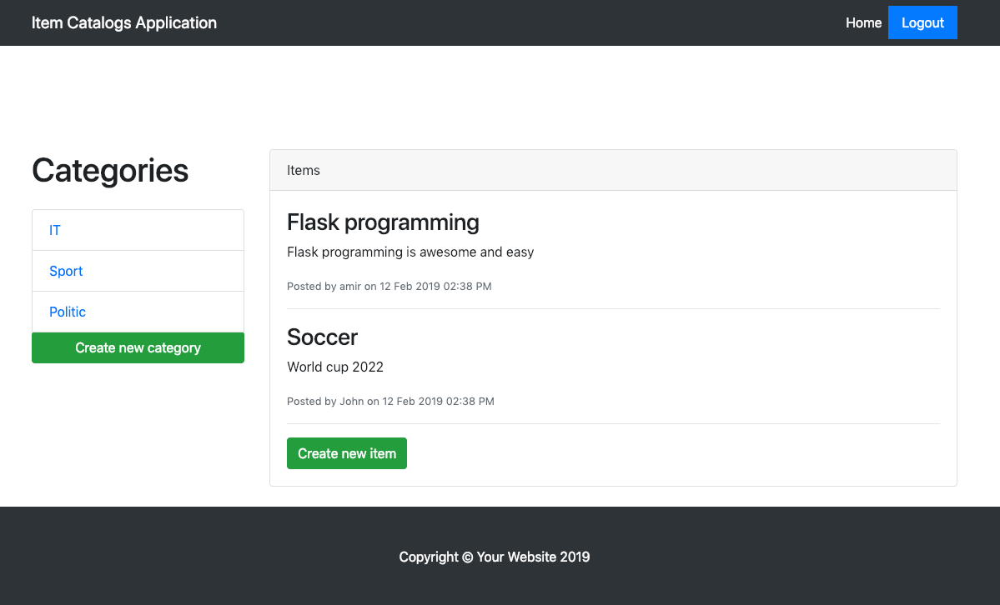

## Create new category

### URL
Url for create new category is `/categories/new`

### View for unauthenticated user
if the user is not logged-in will get redirected to `/login`

### View for authenticated user
If user is authenticated can see the create new category form

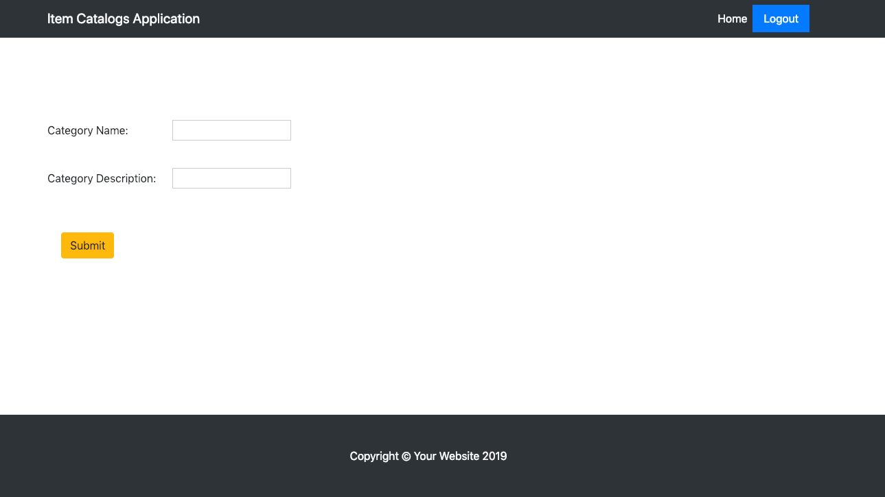

## Create new item
Users can create item if they are logged in

### URL

URL for creating new item is `/items/new`

### View for unauthenticated user
if the user is not logged-in will get redirected to `/login`

### View for authenticated user
If user is authenticated can see the create new item form

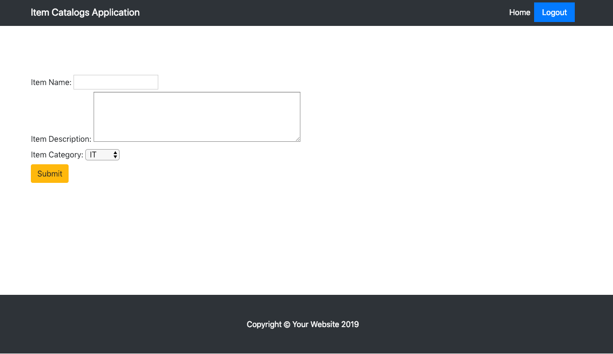

## Edit existing item
Users can edit only items owned by them

### URL

URL for editing existing item is `/items/edit/<item_name>`

### View for unauthenticated user
if the user is not logged-in will get redirected to `/login`

### View for authenticated user
If user is authenticated can see the edit existing item form

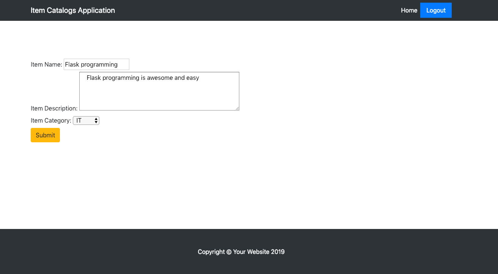

## Delete existing item

### URL

URL for Deleting existing item is `/items/delete/<item_name>`

### View for unauthenticated user
if the user is not logged-in will get redirected to `/login`

### View for authenticated user
If user is authenticated can see the edit existing item form

## API Endpoint

### URL
`/api/catalog.json`

We have an endpoint to show all categories in it's items, this endpoint is open to public
But we have rate limit of 100 requests per day for each ip address to protect the API.

### API result

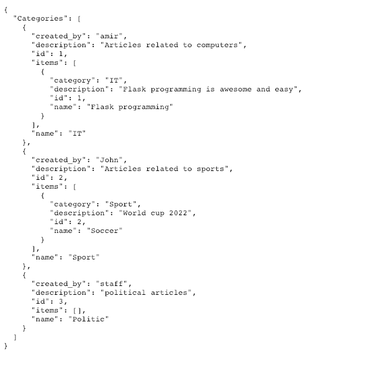
